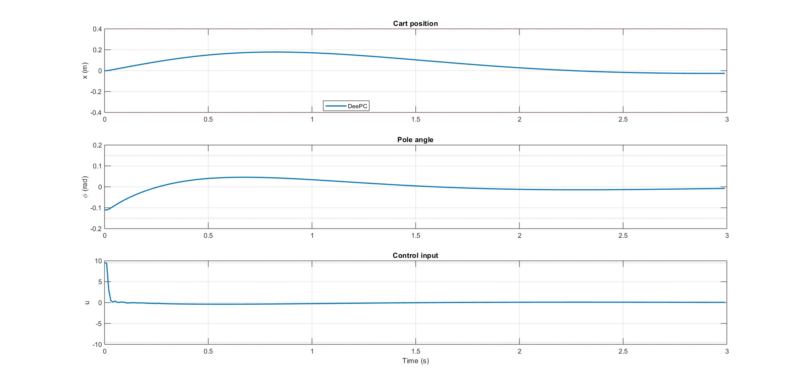
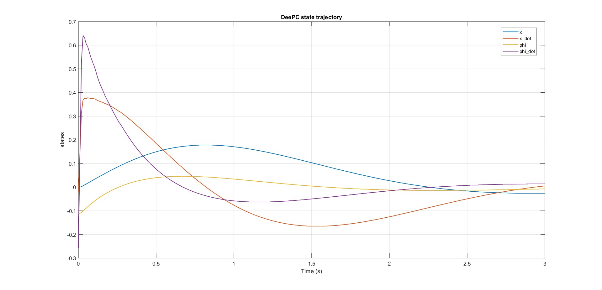
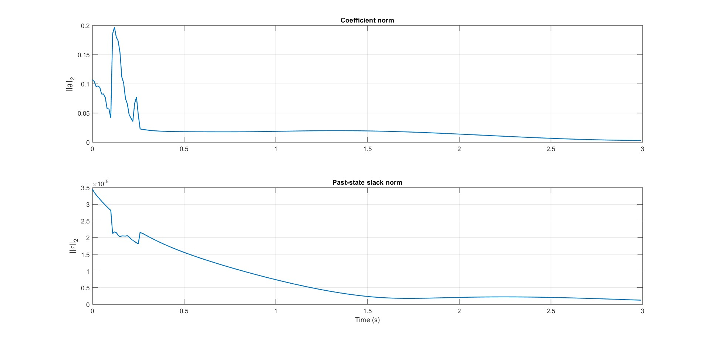
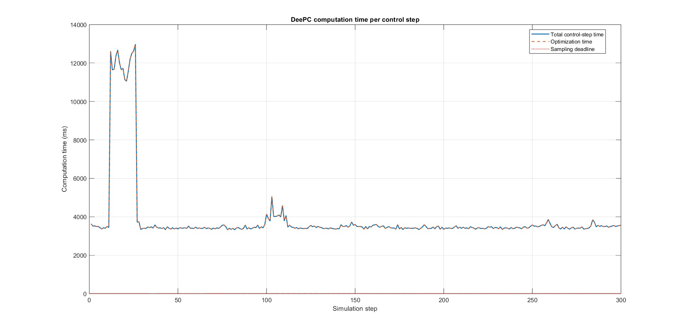

# Data-Enabled Predictive Control for an Inverted Pendulum

This repository implements and compares **Data-Enabled Predictive Control (DeePC)**, **model-based MPC**, and **LQR** for a linearized cart-pole inverted pendulum. The main objective is to move the cart to a reference position while keeping the pendulum upright under input and state constraints.

The project is written in MATLAB and includes the complete workflow: system modeling, data collection, Hankel matrix construction, regularized DeePC optimization, MPC/LQR baselines, result plots, animations, and a LaTeX report.



## Why This Project Matters

The inverted pendulum is an unstable, underactuated benchmark system. Stabilizing it while tracking a cart-position reference is a useful test case for modern control methods because the controller must balance competing goals:

- regulate pendulum angle near the upright equilibrium,
- track cart position,
- respect actuator limits,
- handle finite-horizon prediction,
- compare model-based control against data-driven control.

The main contribution of this project is a regularized DeePC controller that predicts future behavior directly from measured trajectory data using Hankel matrices, instead of enforcing explicit model dynamics inside the online optimizer.

## Control Methods Implemented

| Controller | Main file | Description |
|---|---:|---|
| LQR | `IP_LQR_mod.m` | Discrete-time full-state feedback baseline with feedforward reference tracking. |
| Recursive MPC | `IP_MPC_RECURSIVE.m` | Model-based receding-horizon controller with input constraints, terminal LQR cost, and terminal-set diagnostics. |
| Regularized DeePC | `deepc_reg_running.m` | Main state-based DeePC implementation using Hankel matrices, input/state constraints, slack regularization, and terminal pole-angle constraint. |
| Output DeePC | `deepc_reg.m` | Output-based DeePC variant using measured cart position and pendulum angle. |
| Data collection | `deepc_data_collection.m` | Generates persistently exciting PRBS data and saves Hankel matrices for DeePC. |
| Animation | `animation.m` | Creates MP4 animations from saved LQR, MPC, or DeePC trajectories. |

## Repository Structure

```text
.
|-- deepc_data_collection.m          # PRBS data generation and Hankel matrix construction
|-- deepc_reg_running.m              # Main regularized state-based DeePC controller
|-- deepc_reg.m                      # Output-based regularized DeePC controller
|-- IP_MPC_RECURSIVE.m               # Recursive model predictive controller
|-- IP_LQR_mod.m                     # LQR baseline with feedforward reference tracking
|-- animation.m                      # Generates closed-loop cart-pole animations
|-- install_osqp.m                   # OSQP MATLAB interface installer
|-- deepc_plots/                     # Additional DeePC result figures
|-- first_*.jpg                      # Main DeePC result figures
|-- report.tex                       # IEEE-style technical report
|-- references.bib                   # Report bibliography
|-- *.mat                            # Saved datasets and simulation results
|-- *.jpg, *.png                     # Result figures
`-- *.mp4                            # Controller animations
```

## System Model

The plant is a linearized cart-pole system around the upright equilibrium.

State vector:

```text
x = [cart position, cart velocity, pole angle, pole angular velocity]^T
```

Measured output:

```text
y = [cart position, pole angle]^T
```

Representative parameters:

| Parameter | Value | Meaning |
|---|---:|---|
| `M` | 0.5 kg | Cart mass |
| `m` | 0.2 kg | Pendulum mass |
| `b` | 0.1 N/(m/s) | Cart friction |
| `I` | 0.006 kg m^2 | Pendulum inertia |
| `l` | 0.3 m | Pendulum center-of-mass length |
| `Ts` | 0.01 s | Discrete sampling time |

The continuous-time model is discretized with zero-order hold before controller design.

## DeePC Workflow

The DeePC pipeline is organized as follows:

1. **Model and baseline stabilizer**
   - Build the linearized cart-pole model.
   - Discretize the system at `Ts = 0.01 s`.
   - Compute an LQR stabilizer for closed-loop data collection.

2. **Persistently exciting data collection**
   - Generate bounded PRBS excitation using MATLAB `idinput`.
   - Simulate the cart-pole system under LQR plus excitation.
   - Store input, output, and state trajectories.

3. **Hankel matrix construction**
   - Build block Hankel matrices from collected input, output, and state data.
   - Split them into past and future components:

```text
Up, Uf, Yp, Yf, Xp, Xf
```

4. **Regularized DeePC optimization**
   - Solve a receding-horizon quadratic program.
   - Predict future trajectories from data consistency constraints.
   - Apply only the first optimized input.
   - Repeat at the next sampling instant.

5. **Evaluation**
   - Track cart position.
   - Regulate pendulum angle.
   - Check input and state constraint violations.
   - Measure optimization and total control-step computation time.
   - Save plots and animation-ready trajectories.

## DeePC Optimization Summary

The state-based DeePC controller solves an optimization problem of the form:

```text
minimize
    state tracking cost
  + input effort cost
  + lambda_g * ||g||_1
  + lambda_sigma * ||sigma||_2^2

subject to
    Up * g = past inputs
    Xp * g = past states + sigma
    Uf * g = future inputs
    Xf * g = future states
    input bounds
    cart position bounds
    pole angle bounds
    terminal pole-angle constraint
```

Key implementation choices in `deepc_reg_running.m`:

- full-state tracking cost,
- input bounds `u in [-9.5, 9.5]`,
- cart-position bounds,
- pole-angle bounds,
- slack variable for noisy or imperfect data consistency,
- coefficient regularization on `g`,
- OSQP solver through YALMIP,
- repeated receding-horizon control using a YALMIP `optimizer` object.

## Results and Visualizations

The repository includes generated plots and animations for reviewing controller behavior. The main DeePC result figures are the files whose names start with `first_`, and `inverted_pendulum_deepc.mp4` is the corresponding DeePC animation.

### DeePC Closed-Loop Response


### DeePC State Trajectory



### DeePC Internal Variables



### DeePC Computation Time



Animation files are also included:

- `inverted_pendulum_lqr.mp4`
- `inverted_pendulum_mpc.mp4`
- `inverted_pendulum_deepc.mp4` - DeePC animation corresponding to the `first_*` result figures

## How to Run

### 1. Install Requirements

Required:

- MATLAB
- Control System Toolbox
- YALMIP
- OSQP MATLAB interface

Used by specific scripts:

- System Identification Toolbox for `idinput` in `deepc_data_collection.m`
- Optimization Toolbox for optional `linprog` terminal-set verification in `IP_MPC_RECURSIVE.m`

Install OSQP from MATLAB:

```matlab
install_osqp
```

Make sure YALMIP is on the MATLAB path before running the controllers.

### 2. Generate DeePC Dataset

```matlab
deepc_data_collection
```

This creates:

- `deepc_dataset.mat`
- `deepc_cartpole_dataset.mat`

The script also prints persistency-of-excitation and dataset quality diagnostics.

### 3. Run Baseline Controllers

```matlab
IP_LQR_mod
IP_MPC_RECURSIVE
```

These generate:

- `lqr_baseline.mat`
- `mpc_recursive_results.mat`

### 4. Run DeePC Controller

```matlab
deepc_reg_running
```

This generates:

- `deepc_yalmip_results_versionB.mat`
- DeePC trajectory plots
- DeePC computation-time diagnostics

### 5. Generate Animation

Open `animation.m`, select the desired result file, then run:

```matlab
animation
```

For example, to animate DeePC:

```matlab
results_file = 'deepc_yalmip_results_versionB.mat';
output_video = 'inverted_pendulum_deepc.mp4';
```

## Technical Skills Demonstrated

- Linear state-space modeling of an unstable system
- Discrete-time controller design
- LQR baseline design
- Model predictive control with YALMIP
- Terminal cost and terminal-set reasoning
- Data-driven predictive control using Hankel matrices
- Persistency-of-excitation checks
- Regularization and slack-variable tuning
- Constraint handling for safety-critical states and actuator bounds
- MATLAB simulation, plotting, and animation
- Technical reporting in LaTeX

## Notes for Reviewers

The main file to inspect first is:

```text
deepc_reg_running.m
```

It contains the core regularized DeePC implementation. For the full experimental flow, inspect the files in this order:

```text
deepc_data_collection.m
deepc_reg_running.m
IP_MPC_RECURSIVE.m
IP_LQR_mod.m
animation.m
report.tex
```

## References

The theoretical background is documented in `report.tex` and `references.bib`, including Data-Enabled Predictive Control and robust/kernelized DeePC references.
